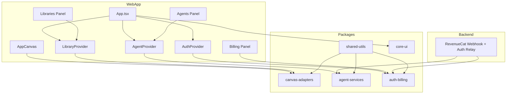
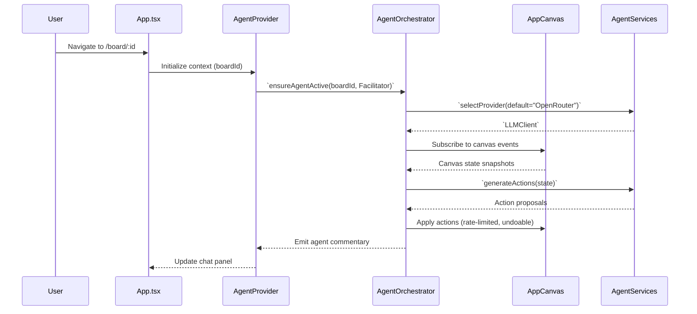

# tl;justdraw! Initial Architecture & AST Abstraction (2025-02-14)

## Repository Baseline Assessment

- Current repository contains documentation files (`PROMPT.md`, `PRD_Barnstormer.md`) and assets (`ASSETS/tldr-logo.png`).
- No application source code or build tooling is present; the project requires full scaffolding.
- No prior hybrid knowledge graph export or AST snapshot was available; this document establishes the canonical starting point that future syncs must align with.

## Planned Monorepo Structure

```text
/ (repo root)
├── apps/
│   ├── web/                # Vite + React + TS PWA (primary client)
│   └── desktop/            # Tauri shell wrapping the web build
├── packages/
│   ├── core-ui/            # Shared UI primitives (buttons, panels, theming)
│   ├── canvas-adapters/    # tldraw integration & excalidraw import utilities
│   ├── agent-services/     # LLM abstraction layer + orchestrators
│   ├── auth-billing/       # SSO + RevenueCat client SDK bindings
│   └── shared-utils/       # Logger, error utils, types, config loaders
├── server/                 # Minimal backend (RevenueCat webhooks, auth relay)
├── infra/                  # CI/CD pipelines, build scripts, Tauri packaging
├── docs/                   # Architecture, checklists, manuals (this file)
└── tests/                  # Cross-package integration & e2e suites
```

## Abstract Syntax Tree (AST) Representation (Planned)

The following table outlines the top-level modules/classes/functions to be introduced. It represents the intended AST skeleton that downstream coding must follow.

| Module Path | Primary Exports | Responsibilities |
|-------------|-----------------|------------------|
| `packages/shared-utils/src/config.ts` | `loadEnvConfig()`, `AppConfig` type | Centralized config loading (API keys, feature flags) from `.env`, IndexedDB, secure storage |
| `packages/shared-utils/src/logger.ts` | `createLogger()`, `Logger` interface | Structured logging with sinks for console, file (Tauri), remote ingest |
| `packages/core-ui/src/index.ts` | `ThemeProvider`, `Panel`, `IconButton` | Shared design system components |
| `packages/canvas-adapters/src/tldraw/AppCanvas.tsx` | `AppCanvas` component | Hosts tldraw editor, wires CRDT/WebRTC sync |
| `packages/canvas-adapters/src/excalidraw/importer.ts` | `importExcalidrawLibrary()`, `convertExcalidrawScene()` | Parse `.excalidrawlib.json` & `.excalidraw` into tldraw-compliant data |
| `packages/agent-services/src/providers/openrouter.ts` | `OpenRouterClient` | Default LLM provider via OpenRouter API |
| `packages/agent-services/src/providers/gemini.ts` | `GeminiClient` | Google Gemini provider wrapper |
| `packages/agent-services/src/providers/openai.ts` | `OpenAIClient` | OpenAI-compatible provider |
| `packages/agent-services/src/providers/ollama.ts` | `OllamaClient` | Local model interface |
| `packages/agent-services/src/agentOrchestrator.ts` | `AgentOrchestrator`, `AgentRole`, `AgentEvent` | Always-on facilitator logic, canvas operation queue |
| `packages/auth-billing/src/authService.ts` | `AuthService`, `OAuthProvider`, `AuthSession` | OAuth 2.0 SSO flows (web + Tauri) |
| `packages/auth-billing/src/revenueCatClient.ts` | `RevenueCatClient`, `Entitlement` enums | Query entitlements, manage offerings |
| `apps/web/src/main.tsx` | Bootstraps React app | Mounts providers, registers service worker |
| `apps/web/src/App.tsx` | `App` component | Layout shell with panels (Canvas, Agents, Libraries, Billing, Account) |
| `apps/web/src/routes/BoardRoute.tsx` | `BoardRoute` | Handles board lifecycle, ensures facilitator agent active |
| `apps/web/src/providers/AgentProvider.tsx` | `AgentProvider`, `useAgent()` | React context bridging orchestrator to UI |
| `apps/web/src/providers/AuthProvider.tsx` | `AuthProvider`, `useAuth()` | Manage auth state + entitlements |
| `apps/web/src/providers/LibraryProvider.tsx` | `LibraryProvider`, `useLibraryManager()` | Manage Excalidraw library state |
| `apps/web/src/serviceWorkerRegistration.ts` | `registerServiceWorker()` | PWA offline + background sync hooks |
| `apps/web/public/manifest.json` | — | PWA manifest |
| `apps/desktop/src-tauri/tauri.conf.json` | — | Tauri configuration (build identifiers, secure storage) |
| `server/src/index.ts` | Express app exports | RevenueCat webhook receiver, auth token exchange |
| `tests/e2e/agent-canvas.spec.ts` | Playwright test | Validates agent operations & canvas sync |

## UML Component Diagram (Mermaid)



## Sequence Diagram: Agent Facilitator Joining a Board



## Data & Build Pipelines

1. **CI/CD Build Matrix**
   - GitHub Actions workflow building web (Vite) + service worker tests.
   - Tauri build job generating `.msi`, `.exe`, `.appimage`, `.deb`, `.dmg`, `.apk` with epoch-based 4-digit build number embedded in filenames, GUI About modal, and window corner watermark.
   - Artifact upload + release tagging.

2. **Storage Strategy**
   - IndexedDB for offline board caches.
   - Secure storage (Tauri) for API tokens and offline auth refresh tokens.
   - Optional cloud sync via backend when entitlements allow (`cloud_sync`).

3. **Security Considerations**
   - OAuth PKCE for web, deep-link callback for Tauri.
   - Providers stored in encrypted secure storage.
   - RevenueCat API keys kept server-side only.

## Alignment with Hybrid Knowledge Graph

- UUIDv8 for project namespace: `urn:uuid:7f4c7a4c-9f51-4a78-958b-8d20ad1bd8a1`.
- This document should be mirrored into the hybrid knowledge graph under the node `Project {name: "tl;justdraw!", uuid: "7f4c7a4c-9f51-4a78-958b-8d20ad1bd8a1"}` with relationships to planned modules.
- Future modifications MUST update both this document and the graph to avoid drift.

## Next Steps

1. Generate a granular implementation checklist (docs/checklists) referencing this AST.
2. Scaffold repository structure following the plan.
3. Implement modules incrementally with continuous testing.
