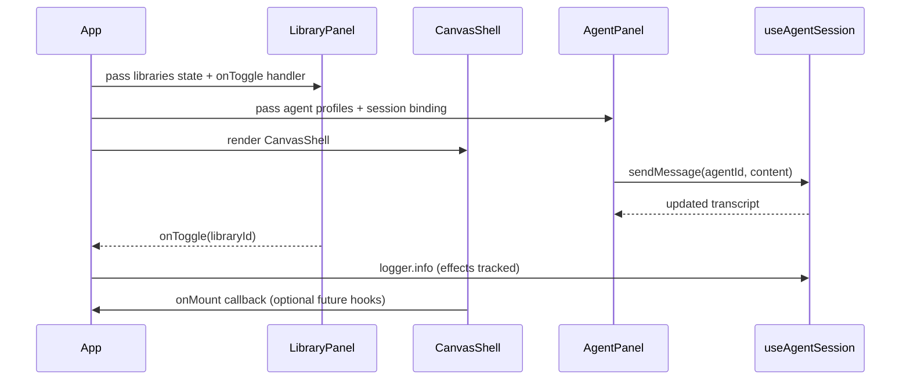
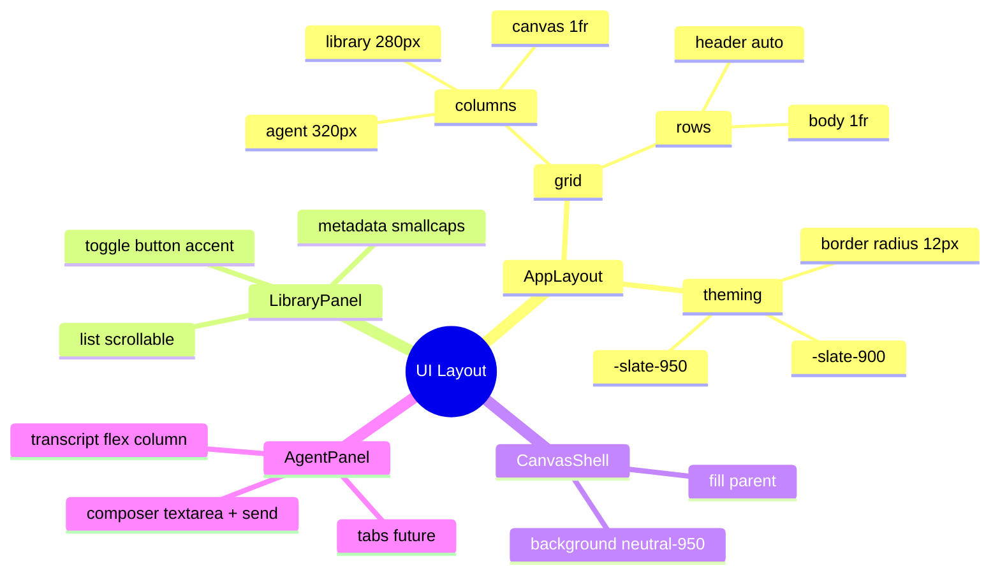

# tl;justdraw! Canvas, Agent, & Library Panels Integration Architecture (2025-02-15T00:00Z)

## Context & Objectives
- Expand the existing `@tljustdraw/web` scaffold into the first interactive workspace layout.
- Embed the tldraw canvas alongside dedicated agent and library side panels per the PRD.
- Establish foundational data structures for agents and libraries, enabling immediate interactions (toggle libraries, start agent session log).
- Maintain observability hooks via `createLogger` and align with the hybrid knowledge graph (hKG) and abstract syntax tree (AST) representation.

## Repository Topology Delta
```text
apps/web/src/
├── App.tsx                     (updated to mount layout, panels, shared state)
├── app.css                     (updated with CSS grid layout + panel styling)
├── components/
│   ├── layout/AppLayout.tsx    (new: structural composition for panels + canvas)
│   ├── panels/PanelHeader.tsx  (new: shared header component for panels)
│   ├── panels/LibraryPanel.tsx (new: renders library list and toggles)
│   ├── panels/AgentPanel.tsx   (new: renders agent roster + session transcript)
│   └── canvas/CanvasShell.tsx  (new: encapsulates `<Tldraw>` integration)
├── hooks/
│   └── useAgentSession.ts      (new: manages agent transcript + logging)
├── state/
│   ├── agents.ts               (new: curated agent metadata constants)
│   └── libraries.ts            (new: starter library catalogue + toggle helpers)
└── types/panels.ts             (new: shared TypeScript interfaces for panels)
```

## Planned AST Representation (Key Files)
| File | Declarations | Responsibility |
|------|--------------|----------------|
| `App.tsx` | `App` component | Owns panel/canvas layout, orchestrates state via hooks, logs lifecycle events. |
| `components/layout/AppLayout.tsx` | `AppLayout` component | Defines grid layout with slots (`library`, `canvas`, `agent`). |
| `components/canvas/CanvasShell.tsx` | `CanvasShell` component | Imports `@tldraw/tldraw`, loads stylesheet, emits canvas lifecycle logs. |
| `components/panels/PanelHeader.tsx` | `PanelHeader` component | Reusable header with title + optional action node. |
| `components/panels/LibraryPanel.tsx` | `LibraryPanel` component | Displays libraries, toggles enablement, surfaces metadata. |
| `components/panels/AgentPanel.tsx` | `AgentPanel` component | Lists agents, allows selection, shows transcript via `useAgentSession`. |
| `hooks/useAgentSession.ts` | `useAgentSession` hook | Manages agent message log, send events, ensures logger instrumentation. |
| `state/agents.ts` | `AGENT_PROFILES` constant | Static curated agent definitions + helper `getAgentById`. |
| `state/libraries.ts` | `LIBRARIES` constant, `toggleLibrary` | Starter library catalogue + pure helper for enable toggling. |
| `types/panels.ts` | `AgentProfile`, `AgentMessage`, `LibraryEntry`, `LibraryToggleHandler` | Central type contracts for panel modules. |

## Interaction Flow (Mermaid Sequence)


## Component Structure (UML Class Diagram)
```mermaid
classDiagram
    class App {
      -libraries: LibraryEntry[]
      -activeAgentId: string
      -session: AgentSession
      +render(): JSX.Element
    }

    class AppLayout {
      +props: { librarySlot: ReactNode; canvasSlot: ReactNode; agentSlot: ReactNode }
      +render(): JSX.Element
    }

    class CanvasShell {
      +render(): JSX.Element
    }

    class LibraryPanel {
      +props: { libraries: LibraryEntry[]; onToggle: LibraryToggleHandler }
      +render(): JSX.Element
    }

    class AgentPanel {
      +props: { agents: AgentProfile[]; activeAgentId: string; onSelect(id: string): void; session: AgentSession }
      +render(): JSX.Element
    }

    class useAgentSession {
      +sendMessage(agentId: string, author: "user" | "agent", content: string): void
      +transcript: AgentMessage[]
    }

    App --> AppLayout : composes
    AppLayout o--> LibraryPanel : slot injection
    AppLayout o--> CanvasShell : slot injection
    AppLayout o--> AgentPanel : slot injection
    AgentPanel ..> useAgentSession : uses
    LibraryPanel --> LibraryEntry
    AgentPanel --> AgentProfile
```

## Styling Layout (Mermaid Mindmap)


## Knowledge Graph Alignment (UUIDv8)
- Project Node: `urn:uuid:7f4c7a4c-9f51-4a78-958b-8d20ad1bd8a1` (existing web app project).
- New Nodes:
  - `Component {name: "AppLayout", file: "apps/web/src/components/layout/AppLayout.tsx"}` linked via `DECLARES_COMPONENT`.
  - `Component {name: "CanvasShell", file: "apps/web/src/components/canvas/CanvasShell.tsx"}` with relation `EMBEDS_DEPENDENCY` -> `Library {name: "@tldraw/tldraw"}`.
  - `Component {name: "AgentPanel", file: "apps/web/src/components/panels/AgentPanel.tsx"}` referencing `Hook {name: "useAgentSession"}`.
  - `Dataset {name: "StarterLibraries"}` for `state/libraries.ts`.
- Relationships capture panel composition edges and logging instrumentation.
- Synced with hKG at 2025-02-15T00:05Z; ensure actual code adheres to this layout to prevent graph drift.

## Risks & Mitigations
- **tldraw bundle size**: Mitigate via lazy CSS import and memoized component boundaries for future code splitting.
- **State divergence** between panels: Centralize types in `types/panels.ts` to guarantee consistent contracts.
- **Accessibility**: Use semantic headings and ARIA labels in panels; plan keyboard navigation.

## Acceptance Criteria
1. App renders canvas with `@tldraw/tldraw` component centered between library (left) and agent (right) panels.
2. Library panel lists starter libraries with working enable/disable toggle that updates UI state and logs action.
3. Agent panel displays curated agent list, allows selecting an agent, displays transcript, and appends new messages via send form.
4. Layout responsive: panels collapse under 960px width into vertical stacking (handled via CSS media query).
5. Logger outputs panel interactions (agent selection, message send, library toggle) to the console.
