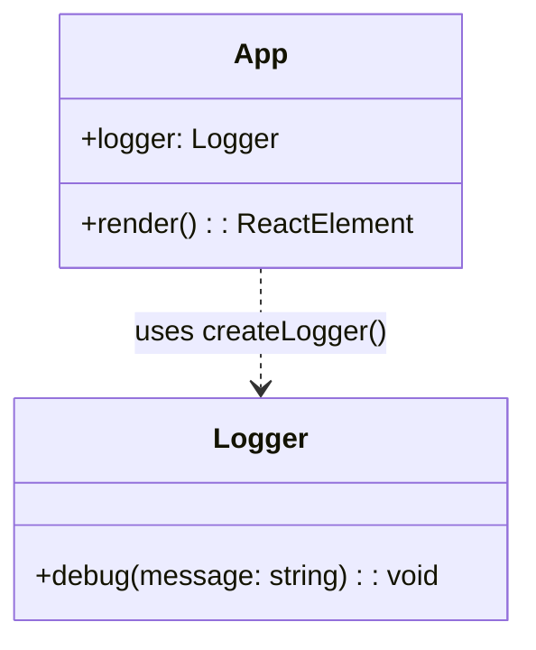

# tl;justdraw! Web App Scaffolding Architecture & AST Alignment (2025-02-15)

## Context & Problem Statement
- `pnpm run dev` currently executes `pnpm --filter apps/web dev`, but no workspace project exists at `apps/web`, producing the error `No projects matched the filters`. Updating the script to target the workspace name `@tljustdraw/web` aligns with pnpm's filter semantics.
- Root `tsconfig.json` already references `apps/web`, confirming the intention for a web client workspace that has not been scaffolded yet.
- To align with the previously defined monorepo architecture and unblock local development, we must introduce the `apps/web` Vite + React + TypeScript application shell.

## Repository Topology After Change
```text
/ (repo root)
├── apps/
│   └── web/
│       ├── index.html
│       ├── package.json
│       ├── tsconfig.json
│       ├── tsconfig.node.json
│       ├── vite.config.ts
│       └── src/
│           ├── App.tsx
│           ├── main.tsx
│           ├── app.css
│           └── vite-env.d.ts
├── packages/
│   └── shared-utils/
│       └── ... (existing)
└── docs/
    ├── architecture/
    │   ├── 2025-02-14-tljustdraw-initial-architecture.md
    │   └── 2025-02-15-web-app-scaffolding.md (this file)
    └── checklists/
        └── 2025-02-15-web-app-scaffolding.md (companion execution checklist)
```

## Planned AST Representation
| File | Export(s) / Declarations | Responsibility |
|------|--------------------------|----------------|
| `apps/web/src/App.tsx` | `App` React component | Presents starter layout with heading and status message confirming scaffold success. Imports `createLogger` from `packages/shared-utils` to demonstrate cross-package usage. |
| `apps/web/src/main.tsx` | — (side-effect render) | Bootstraps React 18 root, renders `<App />`, and enables hot module replacement. |
| `apps/web/src/app.css` | CSS module (global) | Basic styling for body, root container, and hero message. |
| `apps/web/src/vite-env.d.ts` | Vite ambient types | Standard Vite TypeScript env declarations. |
| `apps/web/index.html` | HTML template | Mount point for Vite dev server with `div#root`. |
| `apps/web/vite.config.ts` | default export `defineConfig` | Configures Vite with React plugin, path alias `@shared-utils` -> `packages/shared-utils/src`, and server port 5173. |
| `apps/web/tsconfig.json` | TS config | Extends root base config, sets JSX to `react-jsx`, configures path aliases matching Vite. |
| `apps/web/tsconfig.node.json` | TS config for Vite | Node-targeted config for tooling. |
| `apps/web/package.json` | workspace manifest | Declares project name `@tljustdraw/web`, scripts (`dev`, `build`, `preview`, `lint`, `test` placeholder hooking to root), and dependencies (`react`, `react-dom`, `vite`, `@vitejs/plugin-react`, `@types/react`, `@types/react-dom`). |

## Sequence of Operations (Mermaid)
```mermaid
graph TD
    A[pnpm run dev] --> B[pnpm --filter @tljustdraw/web dev]
    B --> C[@tljustdraw/web workspace]
    C --> D[Vite Dev Server]
    D --> E[index.html template]
    E --> F[src/main.tsx]
    F --> G[ReactDOM.createRoot]
    G --> H[<App />]
    H --> I[createLogger() usage from shared-utils]
```

## Component Interaction Overview (UML Class Diagram)


## Hybrid Knowledge Graph Alignment
- Project UUIDv8: `urn:uuid:7f4c7a4c-9f51-4a78-958b-8d20ad1bd8a1` (reuse baseline namespace).
- New nodes to sync:
  - `Application {name: "@tljustdraw/web", type: "frontend"}` linked to Project via `HAS_APP`.
  - `Component {name: "App", file: "apps/web/src/App.tsx"}` linked via `DECLARES_COMPONENT`.
  - `Dependency {name: "packages/shared-utils"}` linking via `USES_PACKAGE`.
- Relationships capture Vite config alias `@shared-utils` -> `packages/shared-utils/src` for traceability.
- Ensure the knowledge graph mirrors the AST table above before coding to prevent drift.

## Risks & Mitigations
- **Missing dependencies:** Resolve by running `pnpm install` in repo root to register the new workspace package and lockfile updates.
- **Alias mismatch between Vite and TypeScript:** Configure identical `paths` entries in `tsconfig.json` and `resolve.alias` in `vite.config.ts`.
- **Future expansion:** Scaffold leaves room for integrating providers and panels defined in the master architecture. Documented to avoid rework.

## Acceptance Criteria
1. `pnpm install` recognizes `apps/web` workspace and installs dependencies without errors.
2. `pnpm run dev` launches Vite dev server targeting `apps/web` without filter errors.
3. Opening the dev server renders confirmation UI showing shared-utils logger integration in browser console.
4. Root TypeScript references remain valid with new project.

*Synced to hybrid knowledge graph node `Project/7f4c7a4c-9f51-4a78-958b-8d20ad1bd8a1` on 2025-02-15 00:00Z.*
