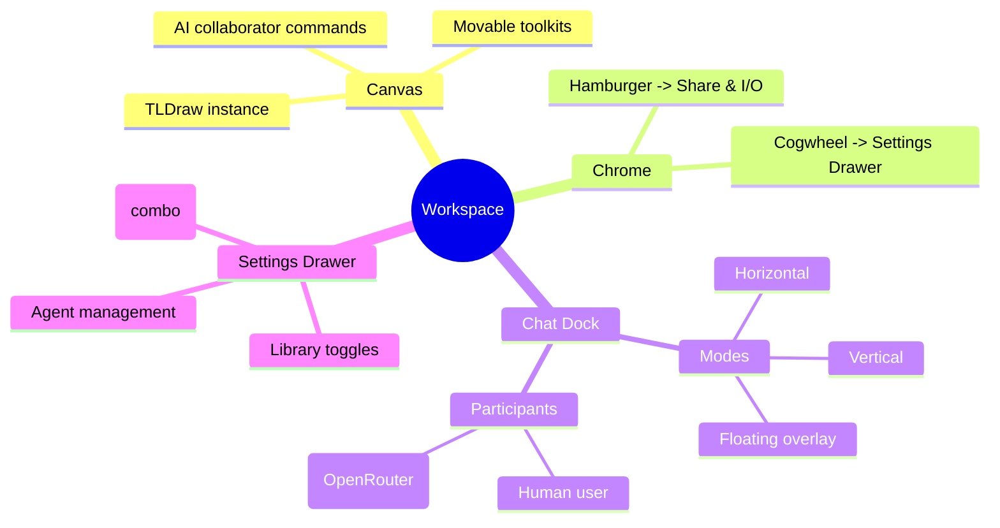

# Architecture Plan — 2025-09-22T01:17:19Z — Workspace refactor & multi-model integration

> NOTE: External hybrid knowledge graph, Neo4j, Postgres, and Qdrant integrations are unavailable in this execution environment. Architecture and checklist documents capture the intended structure; syncing to external systems must be performed manually later.

## Repository Abstract Syntax Tree (AST) Overview

```text
apps/
  web/
    src/
      App.tsx                     # Entry component assembling layout
      app.css                     # Global styling for layout/panels
      components/
        canvas/CanvasShell.tsx    # TLDraw surface wrapper
        layout/AppLayout.tsx      # 3-column shell layout
        panels/
          AgentPanel.tsx          # Agent selection & chat UI
          LibraryPanel.tsx        # Asset library toggles
          PanelHeader.tsx         # Shared panel header
      hooks/
        useAgentSession.ts        # Transcript + composer state machine
      state/
        agents.ts                 # Static agent profiles
        libraries.ts              # Library toggles
      types/panels.ts             # Shared panel types
```

## Target State Architecture Summary

### Functional Goals
1. Promote `openrouter: 'x-ai/grok-4-fast:free'` as default model while supporting dropdown selection of fetched OpenRouter models.
2. Reconfigure workspace to maximize canvas width: hide seldom-used configuration behind cogwheel-triggered menus and allow draggable tool/control boxes on canvas. Provide flexible layout options (horizontal, vertical, floating) for the LLM chat region. Enable LLM agent to act as interactive participant (read canvas state, draw, chat).
3. Provide Share/Invite/Save/Open options (TLDraw export & Excalidraw import) under a hamburger menu.

### Key Components (Proposed)
- `ModelProviderContext` (new) — centralizes model metadata (default, list, loading state) fetched from OpenRouter API.
- `ModelSelector` (new UI control) — combo box for available models with default preselected.
- `WorkspaceLayout` (new) — Replaces rigid `AppLayout`, allowing full-width canvas and movable control docks. Contains:
  - `WorkspaceChrome` — top bar with hamburger (share menu) and cogwheel (configuration).
  - `FloatingPanelLayer` — portal area for draggable panels (library, tools, model selector).
  - `ChatDock` — configurable layout container (horizontal, vertical, floating) for agent chat.
- `AgentCollaborator` (new service/hook) — orchestrates LLM session, enabling TLDraw commands and canvas awareness.
- `ShareMenu` (new) — handles share/invite, TLDraw export, Excalidraw import flows.
- `SettingsDrawer` (new) — cogwheel-triggered overlay for infrequent configuration (libraries, agent roster, model selection fallback).

### Data Flows
- Model list fetched on startup via `useModelCatalog` hook; stored in context accessible to chat + settings.
- TLDraw app state exposed via context to `AgentCollaborator`, enabling AI actions on canvas (initial stub hooking for future integration).
- UI layout state (panel positions, chat docking mode) stored in Zustand store `useWorkspaceLayoutStore` (new) for persistence.

## UML Component Diagram (Mermaid)

```mermaid
direction LR
classDiagram
    class App {
      +useModelCatalog()
      +render()
    }
    class ModelProviderContext {
      +models: OpenRouterModel[]
      +defaultModelId: string
      +setActiveModel(id)
    }
    class WorkspaceLayout {
      +renderCanvas()
      +renderChrome()
    }
    class FloatingPanelLayer
    class ChatDock
    class AgentPanel
    class AgentCollaborator {
      +connectToCanvas(app)
      +sendMessage()
    }
    class ShareMenu

    App --> WorkspaceLayout
    App --> ModelProviderContext
    WorkspaceLayout --> FloatingPanelLayer
    WorkspaceLayout --> ChatDock
    FloatingPanelLayer --> AgentPanel
    WorkspaceLayout --> ShareMenu
    AgentPanel --> AgentCollaborator
    AgentCollaborator --> ModelProviderContext
```

## Mermaid Mind Map — Workspace UX



## Implementation Considerations
- Introduce new state management for panel positions (likely Zustand already available? If not, use built-in context + reducer).
- Ensure TLDraw API integration for share/import/export uses provided helpers (check TLDraw docs) while maintaining offline fallback.
- Replace existing CSS grid layout with CSS variables enabling full viewport usage; allow absolute-positioned floating panels on canvas.
- Provide accessibility for new menus (ARIA roles, keyboard navigation).

