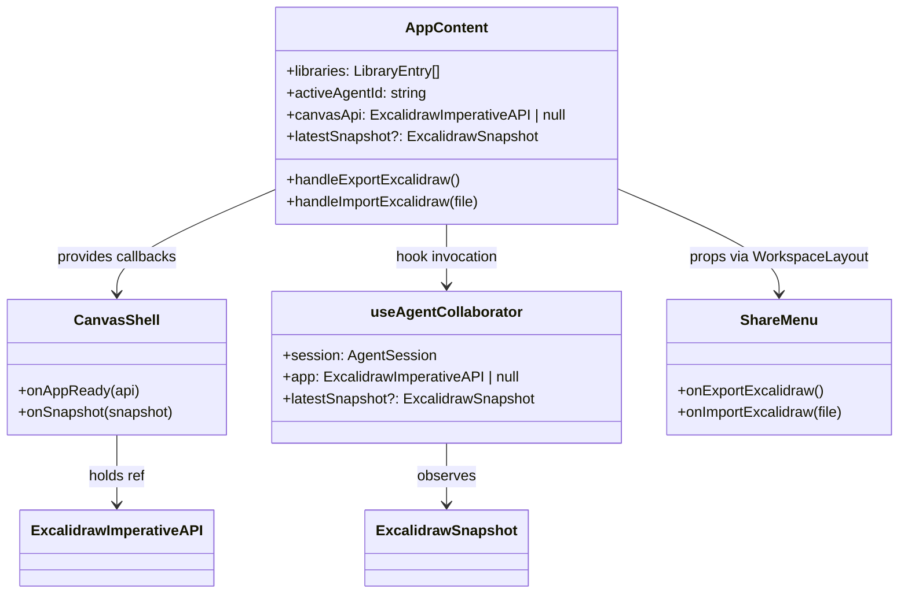
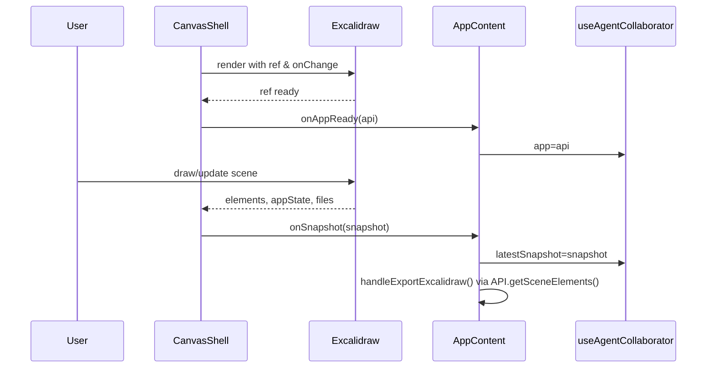

# 2025-09-22T07:05Z — Excalidraw Migration Architecture

> Note: External hybrid knowledge graph synchronization is not available in this workspace; architecture captured locally only.

## 1. Baseline Abstract Syntax Tree (AST) Overview

```text
apps/web/
  src/
    App.tsx                             # Root composition; orchestrates canvas + panels + agents
    components/
      canvas/CanvasShell.tsx           # Wraps <Tldraw>, forwards mount + snapshot callbacks
      layout/
        WorkspaceLayout.tsx            # Shell layout wiring share/settings chrome
        ShareMenu.tsx                  # Export/import/share actions (TLDraw + Excalidraw importer)
      panels/
        AgentPanel.tsx                 # Chat interface with active agent session
        AgentRosterPanel.tsx           # Agent selection list
        LibraryPanel.tsx               # Toggleable library listing
        ModelSelector.tsx              # Active LLM model dropdown
        ChatDock.tsx                   # Dock container for chat
      icons/*                          # Inline SVG icon components
    context/ModelProvider.tsx          # React context for active model id
    hooks/
      useAgentCollaborator.ts          # Syncs TLDraw snapshot with agent session context
      useAgentSession.ts               # Manages agent transcript/state machine
    state/
      agents.ts                        # Static agent roster
      libraries.ts                     # Static library definitions + toggle helper
      workspaceLayout.ts               # Zustand store for UI chrome state
    types/
      panels.ts                        # Shared types for agent/library definitions
packages/
  shared-utils/src/index.ts            # createLogger helper leveraged across app
```

Key TLDraw-specific touch points are `App.tsx`, `components/canvas/CanvasShell.tsx`, and `hooks/useAgentCollaborator.ts`.

## 2. Migration Goals

- Replace TLDraw canvas integration with Excalidraw while maintaining agent workflow, sharing chrome, and library toggles.
- Preserve import/export parity by exporting `.excalidraw` bundles and loading Excalidraw scenes.
- Provide typed snapshot plumbing for agent collaborator hook without TLDraw dependencies.
- Update product messaging (README/PRD snippets) to reference Excalidraw foundation.
- Remove TLDraw dependencies from package manifests.

## 3. Proposed Solution Components

### 3.1 CanvasShell Refactor
- Swap `<Tldraw>` for `<Excalidraw>` with imperative ref via `ExcalidrawImperativeAPI`.
- Emit `onAppReady(api)` once ref resolves.
- Call optional `onSnapshot({ elements, appState, files })` from `onChange` handler, debounced via ref.
- Ensure Excalidraw CSS is imported (`@excalidraw/excalidraw/dist/excalidraw.min.css`).

### 3.2 Application State Wiring
- In `App.tsx`, hold `ExcalidrawImperativeAPI | null` as `canvasApi` state instead of TLDraw.
- Track latest snapshot using new `ExcalidrawSnapshot` type.
- Update export handler to serialize `{ type: 'excalidraw', version, source, elements, appState, files }` using API helpers.
- Update import handler to validate `.excalidraw` payload, load via `canvasApi.updateScene()` and optionally create sticky notes from text-only elements for agent seeding.

### 3.3 Agent Collaboration Hook
- Accept `ExcalidrawImperativeAPI | null` and `ExcalidrawSnapshot | undefined`.
- Log connection events referencing Excalidraw.
- Future extension placeholder for agent-driven edits remains but reframed around Excalidraw scene updates.

### 3.4 Types & Utilities
- Introduce `apps/web/src/types/canvas.ts` defining `ExcalidrawSnapshot` interface bundling `ReadonlyArray<ExcalidrawElement>`, `AppState`, and `BinaryFiles`. Export convenient alias for API type re-use.
- Update imports where needed to centralize type usage.

### 3.5 UI Copy Updates
- Adjust Share menu labels to `.excalidraw`.
- Update README + PRD highlights to describe Excalidraw as primary canvas and note MIT licensing.

### 3.6 Dependency Updates
- Remove `@tldraw/tldraw` from `apps/web/package.json`, add `@excalidraw/excalidraw`.
- Ensure stylesheet bundling works with Vite (direct CSS import within `CanvasShell`).

## 4. Diagrams

### 4.1 Component Interaction (Mermaid UML Class Diagram)



### 4.2 Canvas Lifecycle (Mermaid Sequence Diagram)



## 5. Open Questions & Assumptions

- Excalidraw binary file support: initial implementation persists binary assets in snapshot but does not surface library UI.
- Agent-driven canvas mutations remain future work; current hook stays observational.
- Import routine assumes `.excalidraw` JSON schema; Excalidraw library `.excalidrawlib` handling postponed.

