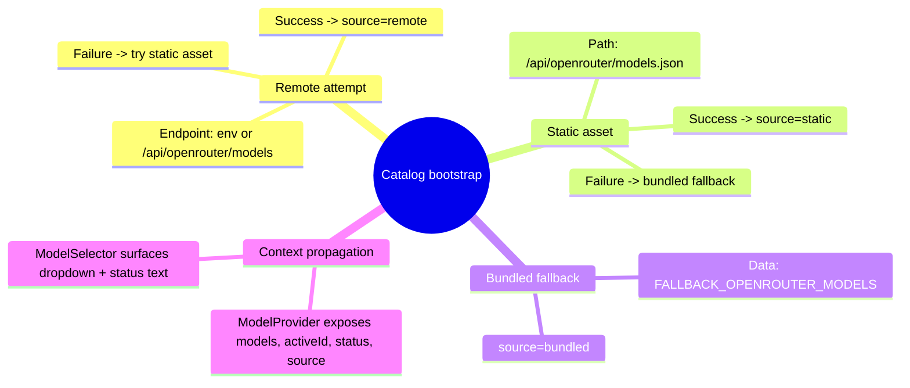

# Architecture Plan — 2025-09-22T14:49Z — Model catalog resilience & blank screen mitigation

> NOTE: External hybrid knowledge graph, Neo4j, Postgres, and Qdrant integrations are unavailable in this execution environment. Architecture and checklist documents capture the intended structure; syncing to external systems must be performed manually later.

## Repository Abstract Syntax Tree (AST) Snapshot

```text
apps/
  web/
    public/
      api/openrouter/models.json     # New static catalog copy served with the app
    src/
      hooks/useModelCatalog.ts       # Catalog loader hook with remote + fallback logic
      context/ModelProvider.tsx      # React context exposing catalog state
      components/panels/ModelSelector.tsx  # UI consumer showing catalog status & dropdown
      state/models.ts                # Types & fallback catalog constants
```

## Problem & Objectives

- **Symptom:** Browser logs `Failed to load models (404)` and UI flashes before rendering a blank page.
- **Root Cause Hypothesis:** Catalog fetching retries `/api/openrouter/models` on mount even when no backend route exists. The repeated failure chain leaves the UI without a stable catalog source in time for dependent components, allowing the view to tear down.
- **Goals:**
  1. Guarantee the catalog is populated synchronously from a bundled asset when the remote endpoint is unavailable.
  2. Track the provenance of the active catalog (`remote`, `static`, `bundled`) for diagnostics/UI messaging.
  3. Prevent multiple fetch attempts that could thrash state during startup.
  4. Keep consuming components decoupled from fetch details while surfacing status to the UI instead of blanking.

## Proposed Solution Overview

1. **Static catalog asset** — Ship `apps/web/public/api/openrouter/models.json` mirroring `FALLBACK_OPENROUTER_MODELS` for environments without an API server.
2. **Enhanced loader hook** — Extend `useModelCatalog` to:
   - Attempt remote fetch (configurable via `VITE_OPENROUTER_MODEL_CATALOG_URL`).
   - On failure, fall back to the static JSON asset before resorting to bundled constants.
   - Track a `catalogSource` state (`'remote' | 'static' | 'bundled'`).
   - Guard with a `didFetchRef` so the async workflow runs only once on mount.
3. **Context contract update** — Propagate `catalogSource` through `ModelProvider` so consumers know which dataset is active.
4. **UI feedback** — Update `ModelSelector` status text to incorporate `catalogSource` and surface fallback messaging instead of rendering nothing.

## UML Component Diagram (Mermaid)

```mermaid
direction LR
classDiagram
    class useModelCatalog {
      +models: OpenRouterModel[]
      +activeModelId: string
      +setActiveModelId(id)
      +loading: boolean
      +error?: string
      +source: CatalogSource
    }
    class ModelProvider {
      +value: ModelContextValue
    }
    class ModelSelector {
      +renderStatus()
      +onChange(modelId)
    }
    class StaticCatalogAsset

    useModelCatalog --> StaticCatalogAsset : fallback
    ModelProvider --> useModelCatalog
    ModelSelector --> ModelProvider
```

## Mermaid Mind Map — Catalog Load Flow



## Implementation Notes

- Reuse `normalizeOpenRouterModel` when parsing JSON from either remote or static asset.
- When falling back, ensure the active model ID remains valid; default to `DEFAULT_OPENROUTER_MODEL_ID` when necessary.
- Preserve logging but downgrade expected static fallback to `info` level to avoid alarming warnings for normal static deployments.
- Provide typed `CatalogSource` union within the hook for clarity across the provider and UI.
- Remember to import the new static asset directory by ensuring Vite serves `apps/web/public` (default behavior).

