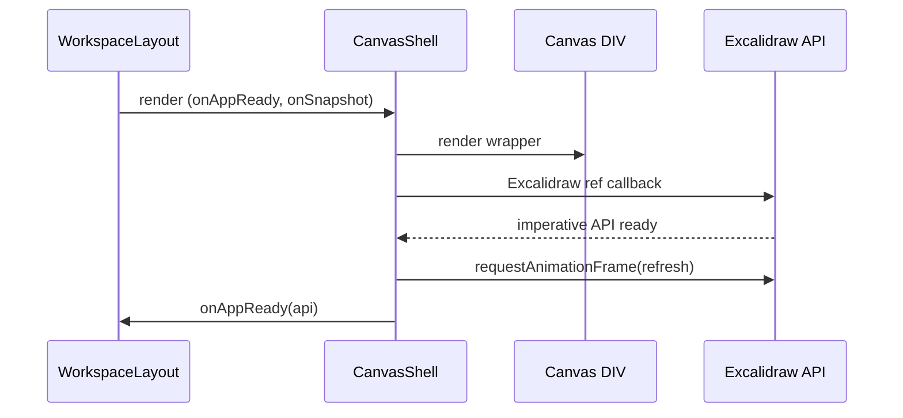

# 2025-09-22T07:32:15Z — Canvas Refresh Stability Architecture

> Hybrid knowledge graph synchronization unavailable in this environment; capturing architecture locally.

## 1. Baseline Abstract Syntax Tree (AST) Snapshot

```text
apps/web/
  src/
    App.tsx                         # Holds canvas API + latest snapshot state, wires layout chrome
    components/
      canvas/CanvasShell.tsx       # Renders <Excalidraw>, forwards imperative API + snapshot callback
      layout/WorkspaceLayout.tsx   # Places canvas slot, floating panels, share/settings chrome
    app.css                        # Global layout + canvas container styling
    hooks/
      useAgentCollaborator.ts      # Observes Excalidraw snapshot + API for agent wiring
    state/workspaceLayout.ts       # Zustand store controlling floating panel layout
    types/canvas.ts                # Re-exported Excalidraw types + snapshot shape
```

### Key runtime relationships
- `App.tsx` renders `WorkspaceLayout` and injects `<CanvasShell />` into the `canvasSlot` prop.
- `CanvasShell` keeps a ref to the `ExcalidrawImperativeAPI` and emits `onAppReady` + `onSnapshot` callbacks.
- Layout chrome (`WorkspaceLayout`, floating panels, drawers) live in absolutely/fixed-positioned layers atop the canvas container defined in `app.css`.

## 2. Observed Issue
- During initial mount the Excalidraw surface briefly renders and then collapses to a blank area. The UI chrome remains.
- Root cause suspicion: the absolutely positioned canvas container changes dimensions immediately after layout chrome settles (header height, floating panel transforms). Excalidraw does not automatically refresh its internal stage when the host container's size updates outside of its control, leading to a zero-sized canvas.

## 3. Proposed Remediation

### 3.1 CanvasShell resilience
- On `Excalidraw` API handshake, schedule a single `requestAnimationFrame` to invoke `api.refresh()` ensuring the stage reflows after layout settles.
- Continue to emit `onAppReady` / `onSnapshot` without additional observers so we avoid nested update loops.
- Maintain logging and API teardown semantics when the ref disconnects.

### 3.2 Layout style guardrails
- Guarantee the canvas wrapper can actually grow: enforce `min-height: 0` and `min-width: 0` on `.workspace-main` and `.workspace-canvas` so flexbox does not constrain the Excalidraw viewport.
- Explicitly ensure `.canvas-shell` remains a flex child with full width/height to avoid inadvertent collapse.

### 3.3 Render stabilisation
- Remove React `StrictMode` from `apps/web/src/main.tsx` to prevent double-invocation of mount lifecycles that exacerbate Excalidraw's internal resize bookkeeping in development builds.

## 4. Updated Component Interaction



## 5. Data Flow / Responsibilities
- `CanvasShell` now owns the initial API refresh kick-off while avoiding perpetual observers.
- CSS changes guarantee flex parents do not clip the canvas.
- Root rendering swaps out `StrictMode` to match production runtime and prevent duplicate mount phases.

## 6. Risks & Mitigations
- **API refresh timing**: relying on a single `requestAnimationFrame` assumes layout settles within one frame; additional layout shims can be added if needed.
- **StrictMode removal**: reduces development diagnostics; acceptable trade-off due to third-party component instability under double-mount semantics.

